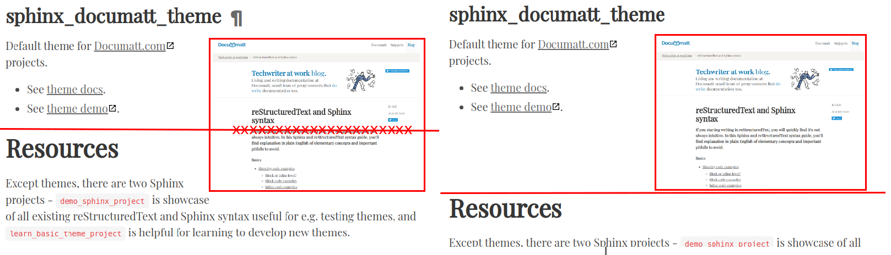

.. based on http://docutils.sourceforge.net/docs/user/rst/demo.txt

##############################
reStructuredText Demonstration
##############################

:field name: This is a generic bibliographic field.
:field name 2:
    Generic bibliographic fields may contain multiple body elements.

    Like this.

.. meta::
   :keywords: reStructuredText, demonstration, demo, parser
   :description lang=en: A demonstration of the reStructuredText
       markup language, containing examples of all basic
       constructs and many advanced constructs.

.. contents:: Table of Contents
.. section-numbering::

********
Sections
********

******
Images
******

Scaling
=======

Original size:

.. image:: img/logo.svg

Scaled to 15% page width, with link to original image:

.. image:: img/logo.svg
   :width: 15%

Scaled without link to original image:

.. image:: img/logo.svg
   :width: 30%
   :class: no-scaled-link

Fixed width and height:

.. image:: img/logo.svg
   :width: 200px
   :height: 200px

Scale option:

.. image:: img/logo.svg
   :scale: 50%

Aligning images
===============

Maintain the enough space between the image and surrounding text.

To the left:

.. image:: img/logo.svg
   :align: left

Lorem ipsum dolor sit amet, consectetur adipisicing elit, sed do eiusmod
tempor incididunt ut labore et dolore magna aliqua. Ut enim ad minim veniam,
quis nostrud exercitation ullamco laboris nisi ut aliquip ex ea commodo
consequat. Duis aute irure dolor in reprehenderit in voluptate velit esse
cillum dolore eu fugiat nulla pariatur. Excepteur sint occaecat cupidatat non
proident, sunt in culpa qui officia deserunt mollit anim id est laborum.

To the center:

.. image:: img/logo.svg
   :align: center

Lorem ipsum dolor sit amet, consectetur adipisicing elit, sed do eiusmod
tempor incididunt ut labore et dolore magna aliqua. Ut enim ad minim veniam,
quis nostrud exercitation ullamco laboris nisi ut aliquip ex ea commodo
consequat. Duis aute irure dolor in reprehenderit in voluptate velit esse
cillum dolore eu fugiat nulla pariatur. Excepteur sint occaecat cupidatat non
proident, sunt in culpa qui officia deserunt mollit anim id est laborum.

To the right:

.. image:: img/logo.svg
   :align: right

Lorem ipsum dolor sit amet, consectetur adipisicing elit, sed do eiusmod
tempor incididunt ut labore et dolore magna aliqua. Ut enim ad minim veniam,
quis nostrud exercitation ullamco laboris nisi ut aliquip ex ea commodo
consequat. Duis aute irure dolor in reprehenderit in voluptate velit esse
cillum dolore eu fugiat nulla pariatur. Excepteur sint occaecat cupidatat non
proident, sunt in culpa qui officia deserunt mollit anim id est laborum.

Clearing images before new section
==================================

The particular tricky scenario is floated image followed by the structure body element like section, rubric, admonition, transition, or the topic. The structure element must clear the floating (``clear: both`` in CSS).

The demo of :doc:`clearing floated images <clearing-floated-images>` in the dedicated document.

Clickable images
================

To another section:

.. image:: img/logo.svg
   :target: `Images`_

To external URL:

.. image:: img/logo.svg
   :target: https://techwriter.documatt.com

Inline images
=============

Inline image aligned to the top |image-top|, to the middle |image-middle|, or bottom |image-bottom| of the text baseline. Previous inline images were with the link to the original image, but this image |image-no-scaled-link| is without the link to the original image.

.. |image-top| image:: /img/favicon.ico
   :align: top
   :height: 20px

.. |image-middle| image:: /img/favicon.ico
   :align: middle
   :height: 25px

.. |image-bottom| image:: /img/favicon.ico
   :align: bottom
   :height: 30px

.. |image-no-scaled-link| image:: /img/favicon.ico
   :height: 35px
   :class: no-scaled-link

*************
Body Elements
*************

.. contents:: :local:

Paragraphs
==========

A paragraph.

Inline Markup
=============

Paragraphs contain text and may contain inline markup: *emphasis*,
**strong emphasis**, ``inline literals``, standalone hyperlinks
(http://www.python.org), external hyperlinks (Python_), internal
cross-references (example_), external hyperlinks with embedded URIs
(`Python web site <http://www.python.org>`__), footnote references
(manually numbered [1]_, anonymous auto-numbered [#]_, labeled
auto-numbered [#label]_, or symbolic [*]_), citation references
([CIT2002]_), substitution references (|favicon|), and _`inline
hyperlink targets` (see Targets_ below for a reference back to here).
Character-level inline markup is also possible (although exceedingly
ugly!) in *re*\ ``Structured``\ *Text*.  Problems are indicated by
|problematic| text (generated by processing errors; this one is
intentional).

The default role for interpreted text is `Title Reference`.  Here are
some explicit interpreted text roles: a PEP reference (:PEP:`287`); an
RFC reference (:RFC:`2822`); a :sub:`subscript`; a :sup:`superscript`;
and explicit roles for :emphasis:`standard` :strong:`inline`
:literal:`markup`.

.. DO NOT RE-WRAP THE FOLLOWING PARAGRAPH!

Let's test wrapping and whitespace significance in inline literals:
``This is an example of --inline-literal --text, --including some--
strangely--hyphenated-words.  Adjust-the-width-of-your-browser-window
to see how the text is wrapped.  -- ---- --------  Now note    the
spacing    between the    words of    this sentence    (words
should    be grouped    in pairs).``

If the ``--pep-references`` option was supplied, there should be a
live link to PEP 258 here.

Bullet Lists
============

- A bullet list

  + Nested bullet list.
  + Nested item 2.

- Item 2.

  Paragraph 2 of item 2.

  * Nested bullet list.
  * Nested item 2.

    - Third level.
    - Item 2.

  * Nested item 3.

Enumerated Lists
================

1. Arabic numerals.

   a) lower alpha)

      (i) (lower roman)

          A. upper alpha.

             I) upper roman)

2. Lists that don't start at 1:

   3. Three

   4. Four

   C. C

   D. D

   iii. iii

   iv. iv

#. List items may also be auto-enumerated.

Definition Lists
================

Term
    Definition
Term : classifier
    Definition paragraph 1.

    Definition paragraph 2.
Term
    Definition

Field Lists
===========

:what: Field lists map field names to field bodies, like database
       records.  They are often part of an extension syntax.  They are
       an unambiguous variant of RFC 2822 fields.

:how arg1 arg2:

    The field marker is a colon, the field name, and a colon.

    The field body may contain one or more body elements, indented
    relative to the field marker.

Option Lists
============

For listing command-line options:

-a            command-line option "a"
-b file       options can have arguments
              and long descriptions
--long        options can be long also
--input=file  long options can also have
              arguments

--very-long-option
              The description can also start on the next line.

              The description may contain multiple body elements,
              regardless of where it starts.

-x, -y, -z    Multiple options are an "option group".
-v, --verbose  Commonly-seen: short & long options.
-1 file, --one=file, --two file
              Multiple options with arguments.
/V            DOS/VMS-style options too

There must be at least two spaces between the option and the
description.

Literal Blocks
==============

Literal blocks are indicated with a double-colon ("::") at the end of
the preceding paragraph (over there ``-->``).  They can be indented::

    if literal_block:
        text = 'is left as-is'
        spaces_and_linebreaks = 'are preserved'
        markup_processing = None

Or they can be quoted without indentation::

>> Great idea!
>
> Why didn't I think of that?

.. parsed-literal::

   *# Prints date only*
   **$ date -I**
   2020-03-03

   Search for date in `man pages <https://manpages.ubuntu.com>`_.

Line Blocks
===========

| This is a line block.  It ends with a blank line.
|     Each new line begins with a vertical bar ("|").
|     Line breaks and initial indents are preserved.
| Continuation lines are wrapped portions of long lines;
  they begin with a space in place of the vertical bar.
|     The left edge of a continuation line need not be aligned with
  the left edge of the text above it.

| This is a second line block.
|
| Blank lines are permitted internally, but they must begin with a "|".

Take it away, Eric the Orchestra Leader!

    | A one, two, a one two three four
    |
    | Half a bee, philosophically,
    |     must, *ipso facto*, half not be.
    | But half the bee has got to be,
    |     *vis a vis* its entity.  D'you see?
    |
    | But can a bee be said to be
    |     or not to be an entire bee,
    |         when half the bee is not a bee,
    |             due to some ancient injury?
    |
    | Singing...

Block Quotes
============

Block quotes consist of indented body elements:

    My theory by A. Elk.  Brackets Miss, brackets.  This theory goes
    as follows and begins now.  All brontosauruses are thin at one
    end, much much thicker in the middle and then thin again at the
    far end.  That is my theory, it is mine, and belongs to me and I
    own it, and what it is too.

    -- Anne Elk (Miss)

Epigraphs
=========

.. epigraph::

   Epigraphs are usually at the beginning of the document, after document title.
   Usually the first paragraph. Epigraph purpose is to briefly describe
   content of the document. You might know first paragraph also as *excerpt* or
   *lead paragraph*.

Doctest Blocks
==============

>>> print 'Python-specific usage examples; begun with ">>>"'
Python-specific usage examples; begun with ">>>"
>>> print '(cut and pasted from interactive Python sessions)'
(cut and pasted from interactive Python sessions)

Tables
======

Here's a grid table followed by a simple table:

+------------------------+------------+----------+----------+
| Header row, column 1   | Header 2   | Header 3 | Header 4 |
| (header rows optional) |            |          |          |
+========================+============+==========+==========+
| body row 1, column 1   | column 2   | column 3 | column 4 |
+------------------------+------------+----------+----------+
| body row 2             | Cells may span columns.          |
+------------------------+------------+---------------------+
| body row 3             | Cells may  | - Table cells       |
+------------------------+ span rows. | - contain           |
| body row 4             |            | - body elements.    |
+------------------------+------------+----------+----------+
| body row 5             | Cells may also be     |          |
|                        | empty: ``-->``        |          |
+------------------------+-----------------------+----------+

=====  =====  ======
   Inputs     Output
------------  ------
  A      B    A or B
=====  =====  ======
False  False  False
True   False  True
False  True   True
True   True   True
=====  =====  ======

Footnotes
=========

.. [1] A footnote contains body elements, consistently indented by at
   least 3 spaces.

   This is the footnote's second paragraph.

.. [#label] Footnotes may be numbered, either manually (as in [1]_) or
   automatically using a "#"-prefixed label.  This footnote has a
   label so it can be referred to from multiple places, both as a
   footnote reference ([#label]_) and as a hyperlink reference
   (label_).

.. [#] This footnote is numbered automatically and anonymously using a
   label of "#" only.

.. [*] Footnotes may also use symbols, specified with a "*" label.
   Here's a reference to the next footnote: [*]_.

.. [*] This footnote shows the next symbol in the sequence.

.. [4] Here's an unreferenced footnote, with a reference to a
   nonexistent footnote: [5]_.

Citations
=========

.. [CIT2002] Citations are text-labeled footnotes. They may be
   rendered separately and differently from footnotes.

Here's a reference to the above, [CIT2002]_, and a [nonexistent]_
citation.

*******
Targets
*******

.. _example:

This paragraph is pointed to by the explicit "example" target. A
reference can be found under `Inline Markup`_, above. `Inline
hyperlink targets`_ are also possible.

Section headers are implicit targets, referred to by name. See
Targets_, which is a subsection of `Body Elements`_.

Explicit external targets are interpolated into references such as
"Python_".

.. _Python: http://www.python.org/

Targets may be indirect and anonymous.  Thus `this phrase`__ may also
refer to the Targets_ section.

__ Targets_

Here's a `hyperlink reference without a target`_, which generates an
error.

Duplicate Target Names
======================

Duplicate names in section headers or other implicit targets will
generate "info" (level-1) system messages.  Duplicate names in
explicit targets will generate "warning" (level-2) system messages.

Duplicate Target Names
======================

Since there are two "Duplicate Target Names" section headers, we
cannot uniquely refer to either of them by name.  If we try to (like
this: `Duplicate Target Names`_), an error is generated.

***********
Transitions
***********

Here's a transition:

---------

It divides the section.

***********
Admonitions
***********

.. Attention:: Directives at large.

.. Caution::

   Don't take any wooden nickels.

.. DANGER:: Mad scientist at work!

.. Error:: Does not compute.

.. Hint:: It's bigger than a bread box.

.. Important::
   - Wash behind your ears.
   - Clean up your room.
   - Call your mother.
   - Back up your data.

.. Note:: This is a note.

.. Tip:: 15% if the service is good.

.. WARNING:: Strong prose may provoke extreme mental exertion.
   Reader discretion is strongly advised.

.. admonition:: And, by the way...

   You can make up your own admonition too.

*****************************
Topics, Sidebars, and Rubrics
*****************************

.. sidebar:: Optional Sidebar Title
   :subtitle: Optional Subtitle

   This is a sidebar.  It is for text outside the flow of the main
   text.

   .. rubric:: This is a rubric inside a sidebar

   Sidebars often appears beside the main text with a border and
   background color.

Sidebars are usually displayed as left or right floating block.

While topics are usually similar to admonitions.

.. topic:: Topic Title

   This is a topic.

Last one here, rubrics, looks like minor heading.

.. rubric:: This is a rubric

****
Misc
****

Target Footnotes
================

.. target-notes::

Replacement Text
================

I recommend you try |Python|_.

.. |Python| replace:: Python, *the* best language around

Compound Paragraph
==================

.. compound::

   This paragraph contains a literal block::

       Connecting... OK
       Transmitting data... OK
       Disconnecting... OK

   and thus consists of a simple paragraph, a literal block, and
   another simple paragraph.  Nonetheless it is semantically *one*
   paragraph.

This construct is called a *compound paragraph* and can be produced
with the "compound" directive.

Substitution Definitions
========================

An inline image (|example|) example:

.. |EXAMPLE| image:: img/logo.svg
.. |favicon| image:: img/favicon.ico
   :width: 2em

(Substitution definitions are not visible in the HTML source.)

Comments
========

Here's one:

.. Comments begin with two dots and a space. Anything may
   follow, except for the syntax of footnotes, hyperlink
   targets, directives, or substitution definitions.

   Double-dashes -- "--" -- must be escaped somehow in HTML output.

(View the HTML source to see the comment.)

Error Handling
==============

Any errors caught during processing will generate system messages.

|*** Expect 6 errors (including this one). ***|

There should be six messages in the following, auto-generated
section, "Docutils System Messages":

.. section should be added by Docutils automatically
