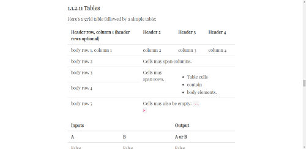

Demo Sphinx project
===================

To properly style all possible markup generated by Sphinx, you need real world Sphinx documentation project. ``demo_sphinx_project`` contains it. See `demo_sphinx_project in action </demo/sphinx_documatt_theme>`_ with :doc:`sphinx_documatt_theme <themes/documatt>`.

If you want to build demo project with your theme, execute in project root::

    scripts/build_theme_demo <theme_name>

Demo will be at ``public/<theme_name>/``. Or, build theme and theme demo in one step::

    scripts/build_all <theme_name>
