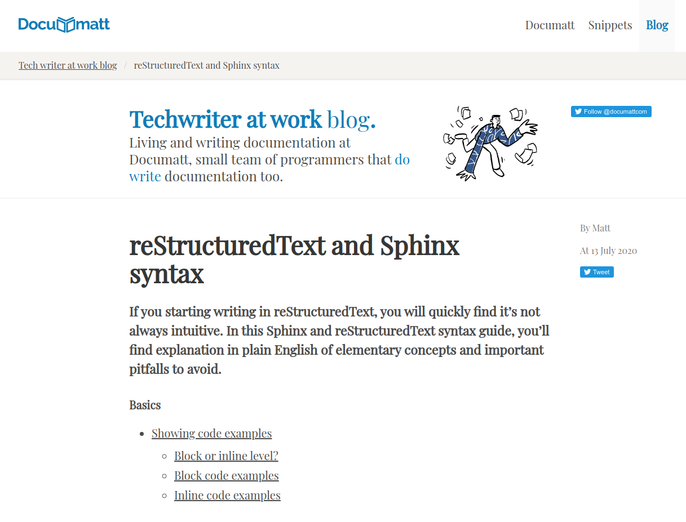

.. Documatt Sphinx Themes Collection documentation master file, created by
   sphinx-quickstart on Thu Feb 18 09:54:02 2021.
   You can adapt this file completely to your liking, but it should at least
   contain the root `toctree` directive.

Welcome to Documatt Sphinx Themes Collection's documentation!
=============================================================

Documatt Sphinx Themes is continuously growing collection of themes for Sphinx documentation projects. Our aim is to provide high quality themes suitable both for documentation and prose. Themes are primary targeted to `Documatt.com <https://documatt.com>`_ users, but anyone is welcome to use it with any Sphinx project.


Themes
------

.. toctree::
   :caption: List of themes
   :glob:
   :hidden:

   themes/*

Repository consist of themes named ``sphinx_<name>_theme``. They are in the single repository for easier managing, but they are deployed as PyPI packages individually. For example sphinx_documatt_theme is installable via ``pip3 install sphinx_documatt_theme``.

Themes are based on amazing `Bulma <https://bulma.io/>`_ CSS framework. For advanced HTML customizations, Bulma knowledge is required.

sphinx_documatt_theme
`````````````````````



Default theme for `Documatt.com <https://documatt.com>`_ projects.

* See :doc:`theme docs <themes/documatt>`.
* See `theme in action <https://documatt.com/sphinx-themes>`_ (this website uses it).

.. toctree::
   :maxdepth: 2
   :caption: Etc.
   :hidden:

   development

.. tip:: Wanna create own Sphinx theme? Checkout our Sphinx Theming Guide at https://documatt.com/blog/20/sphinx-themes.

Indices and tables
------------------

* :ref:`genindex`