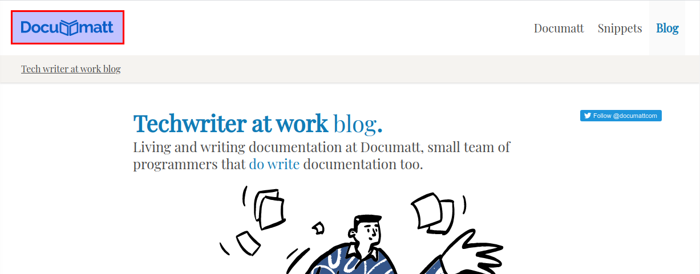
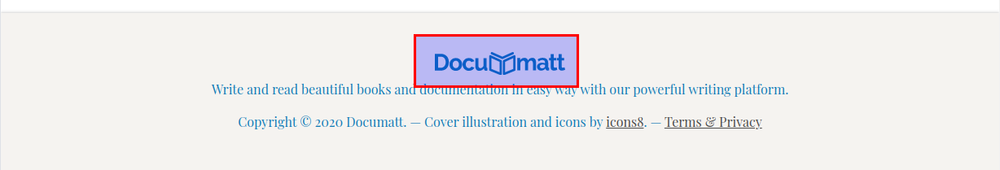
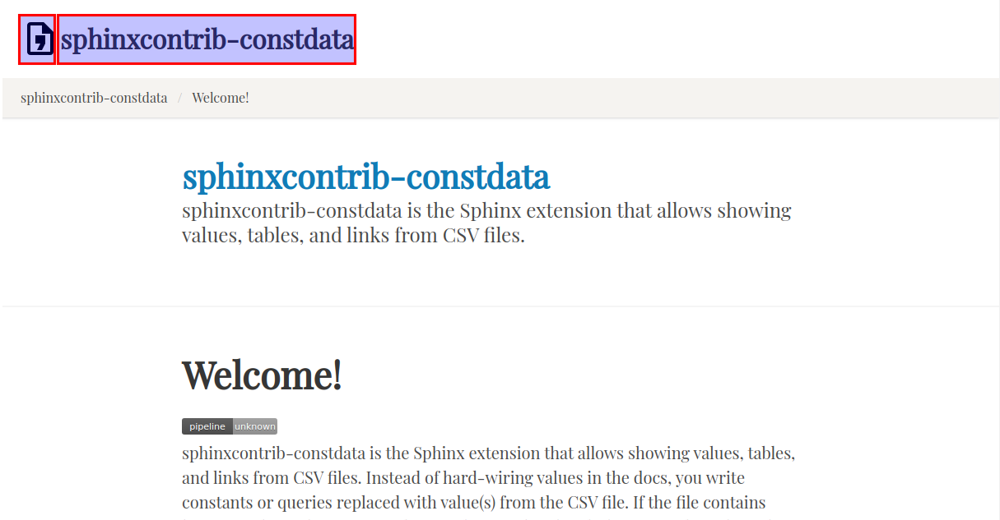
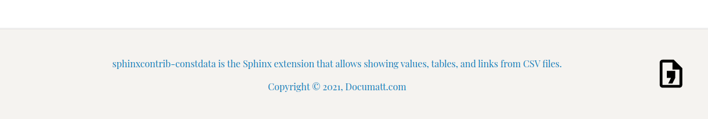
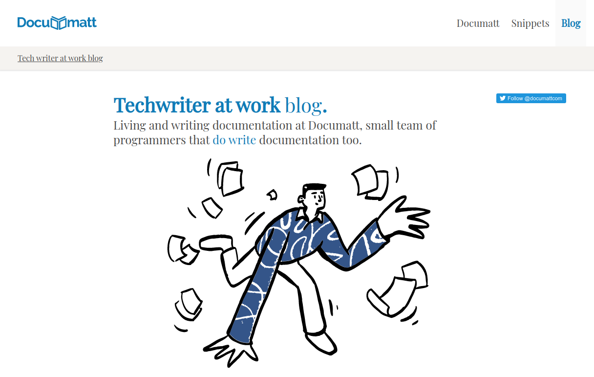
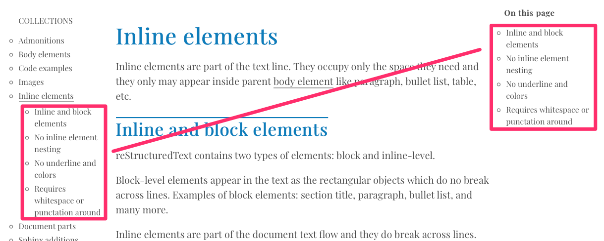

##############
Documatt Theme
##############

Reader friendly Sphinx theme designed to provide great documentation reading experience with a beautiful typography.

This theme is default theme of `Documatt's open-source projects <https://github.com/documatt>`_ but you are welcome to use it with any Sphinx project.

.. image:: img/documatt/screenshot.png

************
Installation
************

Install (on the commandline)::

    $ pip install sphinx-documatt-theme

Use it (in your ``conf.py``)::

    html_theme = "sphinx_documatt_theme"

*************
Customization
*************

Logo and favicon
================

Logo is shown by in the header and footer. Favicon on the browser tab.

For example, if you copied your logo and favicon to the ``img`` as ``logo.svg`` and ``favicon.ico``, set the following in ``conf.py``::

    html_logo = 'img/logo.svg'
    html_favicon = 'img/favicon.ico'

If you don't change these options, Documatt logo and favicon will be used:

Theme options
=============

The following described options all come to the ``html_theme_options`` dictionary in ``conf.py`` file.

For example::

    html_theme_options = {
        'header_text': 'sphinxcontrib-constdata',
    }

Header logo and text
--------------------

.. confval:: header_text

Next to the header logo, you can print a text. By default, it is empty and only the logo is shown.

Example::

    html_theme_options = {
        'header_text': 'sphinxcontrib-constdata',
    }

.. confval:: header_text_style

With this option, you can apply any CSS to the header text.

.. confval:: header_logo_style

With this option, you can apply any CSS to the header logo.

Example::

    html_theme_options = {
        'header_text': 'sphinxcontrib-constdata',
        'header_logo_style': 'width: 3rem;',
    }

Footer logo and text
--------------------

.. confval:: footer_text

Next to the footer logo, you can print a text. By default, it is empty and motto is displayed instead.

Example::

    html_theme_options = {
        'header_text': 'sphinxcontrib-constdata',
    }

.. confval:: footer_text_style

With this option, you can apply any CSS to the footer text.

.. confval:: footer_logo_style

With this option, you can apply any CSS to the footer logo.

Example of logo floated to the right::

    html_theme_options = {
        'footer_logo_style': 'float: right;',
    }

Motto and cover image
---------------------

.. confval:: motto

Motto is short text that is displayed in the bellow the header in the are known as site hero. Motto is printed as-is and thus may contain any HTML markup like ``<a>``.

If ``footer_text`` isn't set, motto is also displayed in the footer.

Example::

    html_theme_options = {
        "motto": "Write and read beautiful books and documentation in easy way with our powerful writing platform."
    }

.. confval:: cover_image

The homepage, unlike all other pages, shows an image bellow the motto called "cover image". Set the path to the image in ``html_theme_options`` as usual. By default, no image is used.

.. confval:: cover_image_style

With this option, you can apply any CSS to the cover image.

Example::

    html_theme_options = {
        'cover_image': 'img/cover.jpg',
        'cover_image_style': 'width: 100px;'
    }

Sidebars
--------

Theme features two sidebars - on the left and the right.

Left sidebar
^^^^^^^^^^^^

Left sidebar is a standard Sphinx sidebar configurable via conf.py's ``html_sidebars`` setting. By default, it contains ``globaltoc.html``.

Right sidebar
^^^^^^^^^^^^^

.. confval:: right_sidebars

Right sidebar is configurable using ``right_sidebars`` in ``html_theme_options``. It is of a string type (not a list!) containing a comma-separated list of sidebar templates.

By default shows ``localtoc.html``. You can use any of `builtin sidebar templates <https://www.sphinx-doc.org/en/master/usage/configuration.html#confval-html_sidebars>`_.

::

    html_theme_options = {
        'right_sidebars': 'localtoc.html, searchbox.html'
    }

To turn off, pass empty string (``'right_sidebars': ''``) or ``None`` (``'right_sidebars': None``).

Global TOC titles only
^^^^^^^^^^^^^^^^^^^^^^

.. confval:: globaltoc_titles_only

By default the left sidebar shows a global TOC, while the right a local TOC. Global TOC has ``globaltoc_titles_only`` configuration that controls whether only document titles or also their subsections will be rendered.

To prevent repeating local TOC twice in both of them, global TOC is limited to document titles only. If you set ``globaltoc_titles_only`` to ``False`` and kept local TOC in right sidebar, it will be show in both of them.

::

    html_theme_options = {
        'globaltoc_titles_only': False
    }

Template blocks
===============

To gain full control of the generated HTML, you need to override original theme ``layout.html`` template.

Create ``_templates/layout.html`` in your Sphinx project root. Start the file with the ``extends`` instruction::

    

Now you can override (customize) *blocks*, i.e. parts of page. The most important blocks are:

* ``navbarmenu`` the menu right to the header logo. The content must be valid `Bulma navbar items <https://bulma.io/documentation/components/navbar/#navbar-item>`_.
* ``mastercover`` content of the a site hero used for master page (usually ``index.rst``).
* ``nonmastercover`` content of the site hero used for non-master pages (usually anything except ``index.rst``).
* ``coverrightcolumn`` right column next to the site hero is useful for example for social buttons.
* ``rightsidebar`` right column next to the main document body. Again, typically used to place share buttons.
* ``extrafooter`` block right before trailing ``</body>``. By default is empty, but it's ideal place to put e.g. your website analytics HTML code or cookie bar.

The full example may look::

    

    
        

            

                <a class="navbar-item"
                   href="https://documatt.com">Documatt</a>
                <a class="navbar-item"
                   href="https://snippets.documatt.com">Snippets</a>
                <a class="navbar-item is-active"
                   href="https://blog.documatt.com">Blog</a>
            

        

    

    
        <h1 class="title is-2 has-text-primary">
            Techwriter at work blog.
        </h1>
        <h2 class="subtitle is-4">
            Living and writing documentation at Documatt, small team of programmers
            that do write documentation too.
        </h2>
    

    
        <a href="https://twitter.com/documattcom?ref_src=twsrc%5Etfw"
           class="twitter-follow-button" data-show-count="false">Follow us</a>
        
    

    
        
    

Open `theme's layout.html <https://github.com/documatt/sphinx-themes/blob/main/sphinx_documatt_theme/sphinx_documatt_theme/layout.html>`_ to see all blocks you can override.

*********
Changelog
*********

.. versionchanged:: 0.0.6

   - Compatibility with Sphinx 7.x: Since `removal of style key in HTML templates <https://github.com/sphinx-doc/sphinx/issues/11381>`_ in 7.0.0, build has failed with ``Reason: UndefinedError("'style' is undefined")`` error.

.. versionadded:: 0.0.5

   - globaltoc as left sidebar configurable as standard html_sidebars (Sphinx sidebars)
   - localtoc as right sidebar configurable via html_options's right_sidebars variable
   - update to Bulma 0.9.2
   - wrap long lines in code examples
   - css for line numbered code examples
   - no underline for L2 sections
   - small CSS fixes
   - theme name and version as ``<meta itemprop>``

.. versionadded:: 0.0.4

   - Theme options header_text_style, footer_text_style.
   - Many CSS fixes: headers, header permalinks, toctree, code examples, :file:, :kdb:

.. versionadded:: 0.0.3

   - Theme options cover_image, cover_image_style, header_text, header_logo_style, footer_text, and footer_logo_style.
   - Header logo and cover title refer to master_doc.
   - Empty navbarmenu block.
   - External link icon stored locally.
   - Fixed clearing structural elements before floated images.
